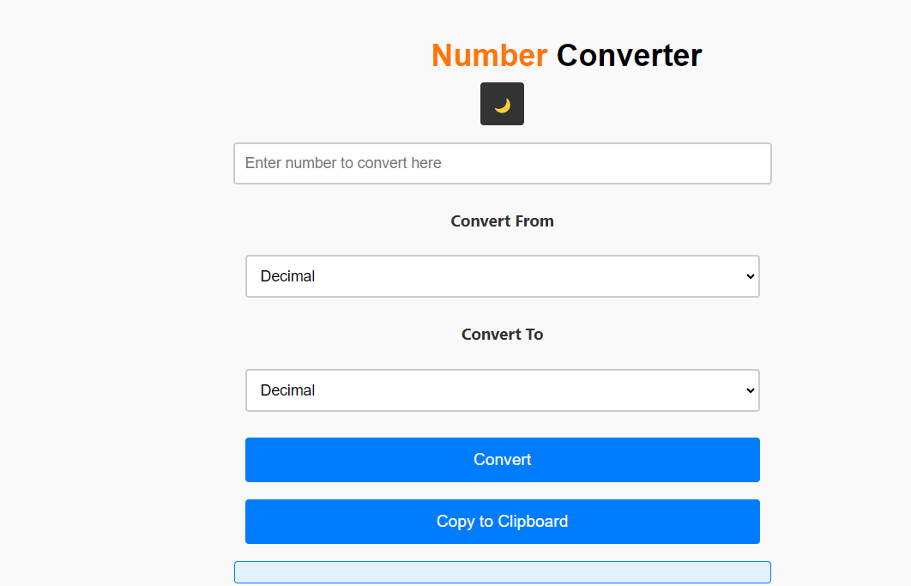

# Number Converter

This application allows users to convert between decimal,binary,octal and hexadecimal number bases.

## Usage
Just input a number and press the convert button

## Features
- Switching between Light and Dark mode
- Clipboard support
- Automatic Conversion as the user types 

## Preview

